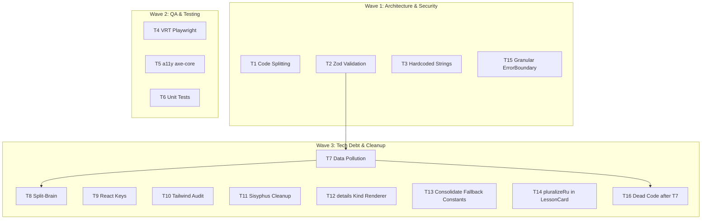

# Refactoring, Cleanup & Hardening Plan (v2 — audited 2026-02-25)

> **Quick Summary**: Комплексный рефакторинг архитектуры, устранение технического долга и усиление стратегии тестирования. План обновлён после аудита кодовой базы — добавлены 5 новых задач (T12–T16), уточнены зависимости между существующими.
>
> **Estimated Effort**: Large &nbsp;|&nbsp; **Parallel Execution**: YES (3 волны + финальная верификация)

---

## Execution Strategy (Parallel Waves)

---

## Wave 1: Architecture & Security (Foundation)

### T1. Изоляция DEV-бандла (Code Splitting)

**Проблема**: Статический `import { ContentKitchenSink }` на [строке 6 App.tsx](file:///d:/Code%20AI/Projects/WSL/Pracharaca-School/src/App.tsx#L6) включает весь код демо-страницы в production-бандл, несмотря на runtime-guard `import.meta.env.DEV`.

**Решение**: Заменить на `React.lazy(() => import('./pages/ContentKitchenSink'))` + `<Suspense>`.

**QA**: `npm run build` — сравнить chunk-size до и после. В prod-бандле не должно быть строк из KitchenSink.

---

### T2. Рантайм-валидация данных (Zod)

**Проблема**: `zod` отсутствует в `package.json`. Адаптеры в [adapters.ts](file:///d:/Code%20AI/Projects/WSL/Pracharaca-School/src/components/content/adapters.ts) тихо возвращают `'Нет данных'` при некорректном JSON — ошибки контента маскируются.

**Решение**: Установить `zod`, описать схемы для `AnswerSectionData`, добавить валидацию в загрузчик JSON. При ошибке парсинга — явный вывод в консоль/ErrorBoundary вместо тихого фоллбека.

**QA**: Подсунуть сломанный JSON → убедиться что ошибка поймана валидатором, а не роняет React-дерево.

---

### T3. Устранение жёсткого кодирования локализации

**Проблема**: **50+ кириллических строк** разбросаны по:
- [TopicPage.tsx](file:///d:/Code%20AI/Projects/WSL/Pracharaca-School/src/pages/TopicPage.tsx) — «К темам», «На главную», «Тема не найдена»
- [LessonPage.tsx](file:///d:/Code%20AI/Projects/WSL/Pracharaca-School/src/pages/LessonPage.tsx) — «К урокам», «Урок не найден»
- [PrevNextNav.tsx](file:///d:/Code%20AI/Projects/WSL/Pracharaca-School/src/components/PrevNextNav.tsx) — «Предыдущий», «Следующий»
- [AnswerSection.tsx](file:///d:/Code%20AI/Projects/WSL/Pracharaca-School/src/components/AnswerSection.tsx) — 14 label'ов секций
- [ErrorBoundary.tsx](file:///d:/Code%20AI/Projects/WSL/Pracharaca-School/src/components/ErrorBoundary.tsx) — «Произошла ошибка»
- [adapters.ts](file:///d:/Code%20AI/Projects/WSL/Pracharaca-School/src/components/content/adapters.ts) — фоллбеки
- [answerRenderers.tsx](file:///d:/Code%20AI/Projects/WSL/Pracharaca-School/src/components/answerRenderers.tsx) — `EMPTY_STATE`

Папка `locales/` не существует.

**Решение**: Создать `src/locales/ru.ts` или настроить `react-i18next`. Извлечь все строки. В `.tsx` использовать ключи словаря.

**QA**: `grep` по `.tsx` файлам не должен находить кириллицу вне словарей/тестов.

---

### T15. ⭐ NEW — Granular ErrorBoundary для AnswerSection

**Проблема**: Ошибка рендеринга в одной `AnswerSection` сейчас роняет всю страницу урока. Нет изоляции на уровне отдельных секций.

**Решение**: Обернуть каждый вызов `renderSectionBody()` в гранулярный `<ErrorBoundary>` с компактным плейсхолдером ошибки (вместо белого экрана). Дополняет T2 — Zod ловит ошибки на этапе парсинга, ErrorBoundary — на этапе рендеринга.

**QA**: Намеренно поломать одну секцию → остальные секции урока продолжают рендериться, вместо сломанной — плейсхолдер.

---

## Wave 2: QA & Testing Enhancements

### T4. Visual Regression Testing (VRT)

**Проблема**: `playwright` отсутствует в зависимостях. Нет эталонных скриншотов — стилевые регрессии обнаруживаются только визуально.

**Решение**: Установить Playwright, создать тесты для Callouts, ComplexStructures, Decorative. Настроить `toHaveScreenshot()` comparisons.

**QA**: `npx playwright test --update-snapshots` → изменить отступ (напр. `p-4` → `p-6`) → тест должен упасть с diff-изображением.

---

### T5. Автоматизированный аудит доступности (a11y)

**Проблема**: `axe-core` отсутствует в зависимостях. Нет автоматической проверки WCAG.

**Решение**: Интегрировать `@axe-core/playwright` или `axe-core` через Vitest. Настроить проверку контрастности, aria-атрибутов, ролей для Timeline, кастомных списков.

**QA**: Запустить a11y-тесты → 0 критических нарушений WCAG.

---

### T6. Изолированные Unit-тесты для UI-компонентов

**Проблема**: Из `src/components/content/` (7 файлов: `Callouts.tsx`, `ComplexStructures.tsx`, `Decorative.tsx`, `Lists.tsx`, `TextAccents.tsx`, `adapters.ts`, `index.ts`) — **ни один не покрыт тестами**. Единственный компонентный тест — [QACard.test.tsx](file:///d:/Code%20AI/Projects/WSL/Pracharaca-School/src/components/QACard.test.tsx).

**Решение**: Написать тесты (React Testing Library) для каждого UI-компонента. Покрыть: рендер без опциональных параметров, экстремально длинный текст, отсутствие иконок.

**QA**: `npm run test` → Coverage по `src/components/content/` ≥ 90% по ветвлениям.

---

## Wave 3: Tech Debt & Deep Cleanup

### T7. Устранение Data Pollution в JSON

> [!WARNING]
> **Зависит от T2**: сначала Zod-валидация, потом удаление migration-флагов.

**Проблема**: **44+ блоков** `"migration": { "isKnownKind": true }` в [01-noble-basics.json](file:///d:/Code%20AI/Projects/WSL/Pracharaca-School/content/topics/krasivyi-konspekt/lessons/01-noble-basics.json) и [02-qa-craft.json](file:///d:/Code%20AI/Projects/WSL/Pracharaca-School/content/topics/krasivyi-konspekt/lessons/02-qa-craft.json).

**Решение**: Удалить все `"migration": { ... }` объекты. Довериться рантайм-валидации (T2) для определения корректности блоков.

**QA**: JSON содержит только семантические данные. Приложение рендерится корректно.

---

### T8. Ликвидация Split-Brain Rendering

> [!WARNING]
> **Зависит от T7** и **T12**: сначала удалить migration-флаги из данных и добавить недостающие new-рендереры.

**Проблема**: Все **14 записей** в [migrationMap.ts](file:///d:/Code%20AI/Projects/WSL/Pracharaca-School/src/content/migrationMap.ts) имеют `status: 'overlap-legacy'`. Два вида (`dosdonts`, `compare`) есть **только** в `renderLegacyByKind`. `renderSectionBody()` на [строке 230](file:///d:/Code%20AI/Projects/WSL/Pracharaca-School/src/components/answerRenderers.tsx#L230) читает `section.migration?.rendererOrder` — мёртвый код после T7.

**Решение**: Удалить legacy-рендереры для мигрированных блоков. Убрать `overlap-legacy` маркеры. Для неизвестных `kind` — безопасный плейсхолдер ошибки валидации вместо текстового фоллбека.

**QA**: В `answerRenderers.tsx` только один линейный путь рендеринга для каждого поддерживаемого вида.

---

### T9. Исправление антипаттерна ключей React

**Проблема**: **6 мест** с `key={index}` в:
- [Lists.tsx](file:///d:/Code%20AI/Projects/WSL/Pracharaca-School/src/components/content/Lists.tsx) — строки 13, 31, 57
- [ComplexStructures.tsx](file:///d:/Code%20AI/Projects/WSL/Pracharaca-School/src/components/content/ComplexStructures.tsx) — строки 19, 54, 88

**Решение**: Заменить на стабильные идентификаторы (content-based hash или id из данных).

**QA**: Линтер + консоль браузера без предупреждений о ключах.

---

### T10. Аудит хрупкости стилей Tailwind

**Проблема**: 2 шаблонных литерала в [LessonCard.tsx](file:///d:/Code%20AI/Projects/WSL/Pracharaca-School/src/components/LessonCard.tsx#L24-L34) используют `${cardStateClasses}` и `${iconStateClasses}`.

**Статус**: ⚠️ **Приоритет НИЖЕ ожидаемого** — переменные содержат полные статические строки классов, Tailwind scanner их найдёт. Но паттерн стоит переписать на `clsx()` для консистентности (пакет `clsx` уже в зависимостях).

**QA**: В production-сборке не должно быть отвалившихся стилей.

---

### T11. Очистка артефактов Sisyphus

**Проблема**: **100+ файлов** (~15 MB) в [.sisyphus/evidence/](file:///d:/Code%20AI/Projects/WSL/Pracharaca-School/.sisyphus/evidence/) от task-1 до task-17 — скриншоты, логи, mp4, json.

**Решение**: Удалить устаревшие артефакты, оставить только README и структуру для текущего цикла.

**QA**: Папка `evidence/` содержит только актуальные данные.

---

### T12. ⭐ NEW — Новый рендерер для `details` kind

**Проблема**: В `renderNewByKind` (строка 189 `answerRenderers.tsx`) нет кейса для `details` — он всегда проваливается в `default: return null` → fallback на `renderLegacyByKind` → `renderText`. Это единственный kind из `MIGRATION_MAP`, для которого нет нового рендерера (кроме `dosdonts`/`compare` — они целенаправленно legacy).

**Решение**: Добавить `case 'details'` в `renderNewByKind` с подходящим визуальным компонентом (paragraph/rich-text primitive), или явно задокументировать, что это ожидаемый fallback.

**QA**: Блоки `details` используют новый рендерер или имеют явный комментарий.

---

### T13. ⭐ NEW — Консолидация дублированных fallback-констант

**Проблема**: Один и тот же фоллбек `'Нет данных'` объявлен дважды:
- `EMPTY_STATE` в [answerRenderers.tsx:17](file:///d:/Code%20AI/Projects/WSL/Pracharaca-School/src/components/answerRenderers.tsx#L17)
- `SAFE_TEXT_FALLBACK` в [adapters.ts:10](file:///d:/Code%20AI/Projects/WSL/Pracharaca-School/src/components/content/adapters.ts#L10)

**Решение**: Консолидировать в одном месте (напр. `adapters.ts`), реэкспортировать. Удалить дубликат.

**QA**: `grep 'Нет данных'` находит только одно объявление.

---

### T14. ⭐ NEW — `pluralizeRu` для `LessonCard`

**Проблема**: [LessonCard.tsx:40](file:///d:/Code%20AI/Projects/WSL/Pracharaca-School/src/components/LessonCard.tsx#L40) содержит `{lesson.cards.length} карточек` без склонения. В `TopicCard.tsx` уже используется `pluralizeRu(['урок', 'урока', 'уроков'])`.

**Решение**: Заменить на `pluralizeRu(lesson.cards.length, ['карточка', 'карточки', 'карточек'])`.

**QA**: Проверить рендер при 1, 2, 5, 21 карточке.

---

### T16. ⭐ NEW — Удаление мёртвого кода после T7

> [!WARNING]
> **Зависит от T7**.

**Проблема**: [answerRenderers.tsx:230](file:///d:/Code%20AI/Projects/WSL/Pracharaca-School/src/components/answerRenderers.tsx#L230) — `section.migration?.rendererOrder` читает данные из JSON. После T7 (удаление `migration` из JSON) этот путь станет мёртвым кодом.

**Решение**: Удалить `section.migration?.rendererOrder` optional chaining, упростить `renderSectionBody` до использования только `resolveMigrationStrategy()`. Удалить `migration` из типа `AnswerSectionData`.

**QA**: Тип `AnswerSectionData` не содержит поле `migration`. Сборка проходит без ошибок.

---

## Dependency Graph (Execution Order)

| Задача | Блокирует | Блокируется |
|--------|-----------|-------------|
| T1 | — | — |
| T2 | T7 | — |
| T3 | — | — |
| T7 | T8, T16 | T2 |
| T8 | — | T7, T12 |
| T12 | T8 | — |
| T16 | — | T7 |
| T15 | — | — |
| Все остальные | — | — |

---

## Success Criteria

- [ ] **F1**: Все 16 задач выполнены
- [ ] **F2**: `npm run build` — нет chunk-size warning, размер `index.[hash].js` снижен
- [ ] **F3**: VRT + a11y + unit тесты проходят зелёным
- [ ] **F4**: Regression Replay — уроки рендерятся, поврежденный JSON обрабатывается без краша
- [ ] **F5**: `grep 'isKnownKind'` по JSON — 0 результатов
- [ ] **F6**: `grep 'Нет данных'` по `.tsx`/`.ts` — ровно 1 объявление
